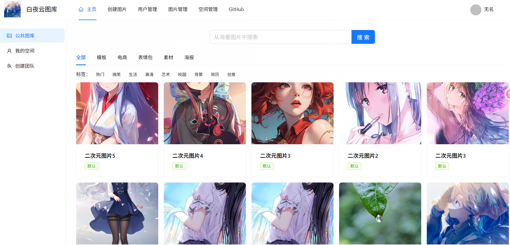
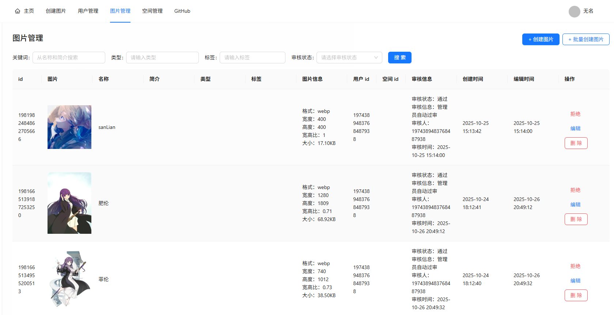
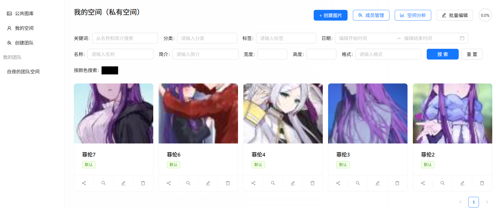
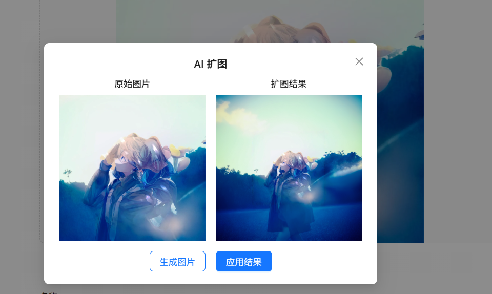
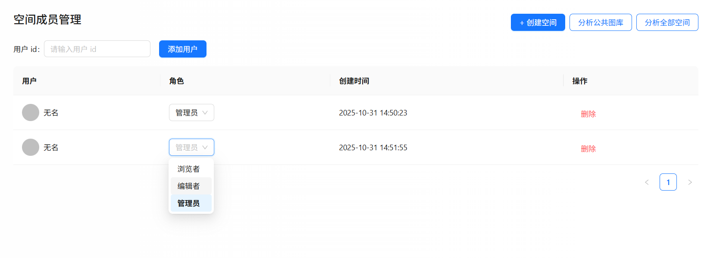
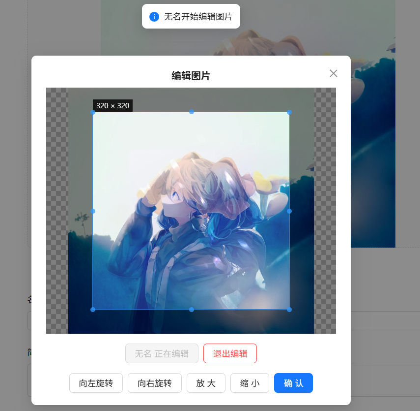
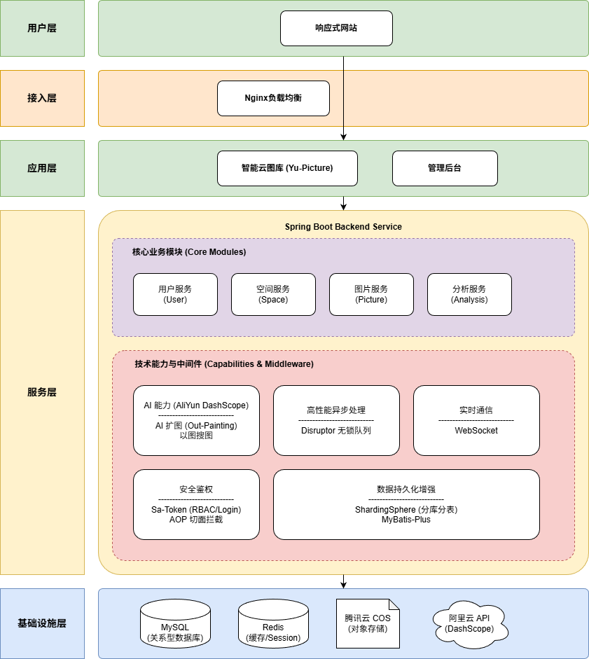

# 白夜智能图库项目介绍
## 了解项目
基于 Spring Boot + Redis + COS + AI + WebSocket 的企业级智能协同云图库平台。
分为公共图库、私有图库和团队共享图库三大模块。用户可在平台公开上传和检索图片;管理员可以上传、审核和管理分析图片。
个人用户可将图片上传至私有空间进行批量管理、多维检索、编辑和分析;企业可开通团队空间并邀请成员，共享和实时协同编辑图片。
## 项目介绍
基于 Vue 3 + Spring Boot + AI + COS + WebSocket 的 **企业级智能协同云图库平台**。

1）所有用户都可以在平台公开上传和检索图片素材，快速找到需要的图片。可用作表情包网站、设计素材网站、壁纸网站等：

2）管理员可以上传、审核和管理图片，并对系统内的图片进行分析：

3）对于个人用户，可将图片上传至私有空间进行批量管理、检索、编辑和分析，用作个人网盘、个人相册、作品集等：

4）AI：接入阿里云百炼的AI绘图大模型，可以AI扩图

5）对于企业，可开通团队空间并邀请成员，共享图片并实时协同编辑图片，提高团队协作效率。可用于提供商业服务，如企业活动相册、企业内部素材库等：

## 技术选型

### 核心框架
*   Spring Boot 2.7.6: 核心应用框架，用于快速构建 Web 应用。
*   JDK 1.8: 开发语言版本。
### 数据存储与访问
*   MySQL: 关系型数据库。
*   MyBatis-Plus 3.5.9: ORM 框架，简化数据库操作。
*   ShardingSphere-JDBC 5.2.0: 用于数据库分库分表（项目中配置了 `picture` 表的动态分表策略）。
*   Redis: 用于缓存及分布式 Session 存储。
### 存储服务
*   腾讯云 COS (Cloud Object Storage): 用于对象存储（如图片上传）。
### 安全与鉴权
*   Sa-Token 1.39.0: 轻量级 Java 权限认证框架，用于处理登录、权限验证等。
### 第三方服务与 AI
*   阿里云百炼 (DashScope): 通过 REST API 调用 AI 服务（如图片扩图/Out-painting）。
### 性能与工具
*   Disruptor 3.4.2: 高性能无锁队列，用于处理高并发事件（如图片编辑事件）。
*   Caffeine: 本地缓存，提升热点数据访问速度。
*   WebSocket: 用于实现前后端实时通信。
*   Hutool 5.8.26: 常用 Java 工具包。
*   Jsoup 1.15.3: HTML 解析器，可能用于抓取或处理网页内容。
*   Lombok: 简化 Java 代码（如 Getter/Setter/Builder）。
*   Knife4j 4.4.0: API 文档生成工具（Swagger 的增强版）。
## 架构设计图
